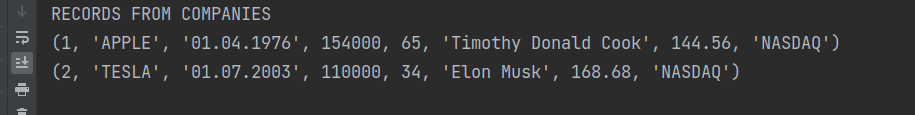
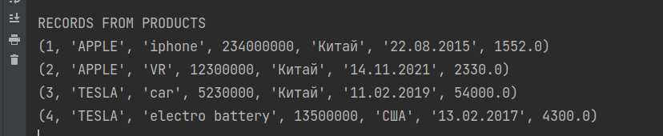

## СУБД + ЯП

**SQLite3 + Python**

SQLite3 - это встроенный в питон модуль. дополнительно устанавливать не надо.
python_version = 3.10.6

## В БД были созданны две таблицы

### Организации

| Колонка                | Тип          | Описание                                           |
|------------------------|--------------|----------------------------------------------------|
| код компании           | INTEGER      | PRIMARY KEY                                        |
| название               | VARCHAR(100) | имя организации                                    |
| дата основания         | DATE         | --------------                                     |
| количество сотрудников | INTEGER      | Количесво работающих на данный момент сотрудников  |
| представительства      | INTEGER      | Количество стран в которых есть представительстваа |
| генеральный директор   | VARCHAR(100) | имя ген директора                                  |
| котировка              | REAL         | Котировка на бирже                                 |
| биржа                  | VARCHAR(100) | Биржа на которой компания котируется               | 

### Продукция 

| Колонка              | Тип          | Описание                                                       |
|----------------------|--------------|----------------------------------------------------------------|
| код продукта         | INTEGER      | PRIMARY KEY                                                    |
| имя организации      | VARCHAR(100) | FOREIGN KEY ('имя организации') REFERENCES companies(название) |
| продукция            | VARCHAR(100) | название продукции                                             |
| ежегодный объем      | INTEGER      | Сколько в год производится                                     |
| страна производитель | VARCHAR(100) | В какой стране производится большая часть продукции            |
| пик продаж           | DATE         | Ежегодный пик продаж                                           |
| средная цена         | REAL         | Средняя цена за единицу товара                                 |

## Создание базы данных

Была созданна БД companies. Если у вас она не работает. Тогда запустите скрипт create_db.py.
Скрипт создат БД а также покажет правильно ли были вставлены данные.

Данные вставленные в таблицу компаний

Данные вставленные в таблицу продукции

